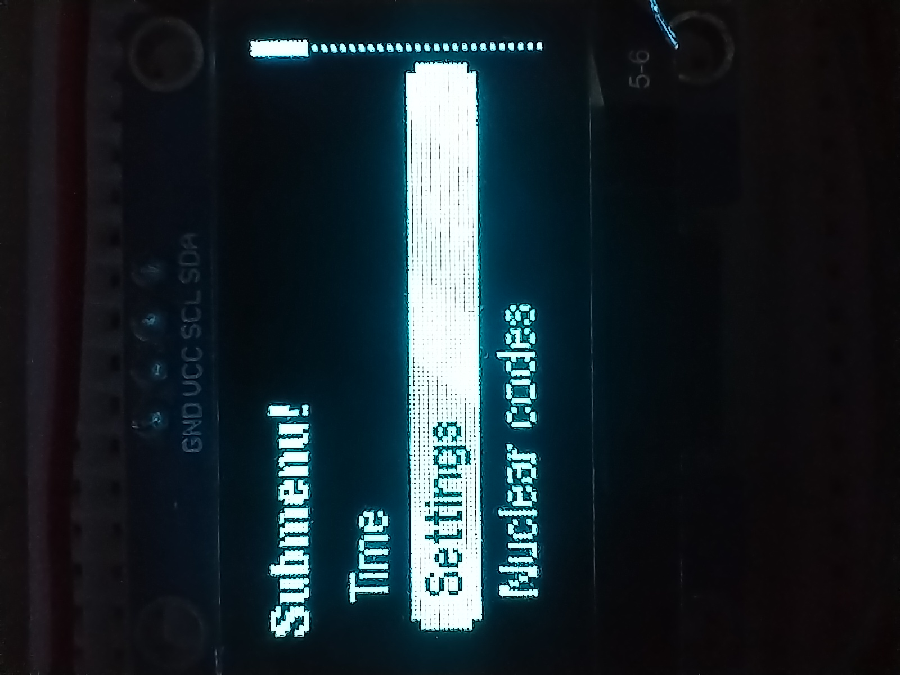

# Pixel View

> A lightweight GUI library for monochrome 128x64 displays to be used with Arduino.

## Installation

### Platform IO

1. Edit your `platform.ini` and include the following:

```ini
lib_deps = https://github.com/ironlungx/pixel-view
```

2. `pio run`

### Arduino IDE

1. Download the current ZIP file from github [here](https://github.com/ironlungx/pixel-view/archive/refs/heads/main.zip)
2. Inside the IDE, go to `Sketch->Include Library->Add a .ZIP library` and select the downloaded zip-file
3. The Library will be installed and you can include the library in your sketch.

## Elements Provided

1. Keyboard:
2. Numpad
3. Radio buttons
4. Check boxes
5. Menu
6. Progress Bars:
7. Dialog Boxes

---

# Library Documentation

## Simple Hello World

```cpp
#include <pixelView.h>
#include <U8g2lib.h>

U8G2 u8g2; ////// REPLACE WITH YOUR DISPLAY

void doDelay(int n) {
  // Replace with vTaskDelay if using FreeRTOS
  delay(n);
}

PixelView pv(&u8g2, sendInput, doDelay, u8g2_font_haxrcorp4089_tr);

// A simple function for input management
// 5 button navigation
//
// This function must return one of the following:
//      - ACTION_UP
//      - ACTION_DOWN
//      - ACTION_LEFT
//      - ACTION_RIGHT
//      - ACTION_SEL

int sendInput() {
  if (digitalRead(BTN_UP))         return ACTION_UP;
  else if (digitalRead(BTN_DOWN))  return ACTION_DOWN;
  else if (digitalRead(BTN_LEFT))  return ACTION_LEFT;
  else if (digitalRead(BTN_RIGHT)) return ACTION_RIGHT;

  if (digitalRead(BTN_SEL) == LOW) return ACTION_SEL;

  return ACTION_NONE;
}

void setup() {
  u8g2.begin();
}

void loop() {
  pv.showMessage("Hello World!!");
}
```

## Overview

**PixelView** is a library designed for **128x64 monochrome OLED displays**. It provides various UI elements such as keyboards, menus, progress bars, and more.

## Classes and Methods

### PixelView Class

This is the main class that handles rendering and input for UI components.

#### Constructor

```cpp
PixelView(U8G2 *display, function<int(void)> inputFunction, function<void(int)> delayer, const uint8_t font[] = u8g2_font_6x12_tr);
```

- **display**: Pointer to a `U8G2` object.
- **inputFunction**: Function that returns any action.
- **delayer**: Function that delays execution for `n` milliseconds.
- **font**: Default font used for rendering (optional).

#### Methods

##### `void wordWrap(int xloc, int yloc, const char *text, bool maintainX = false)`

- **xloc**: X-coordinate to start the text.
- **yloc**: Y-coordinate to start the text.
- **text**: The text to be rendered.
- **maintainX**: If true, the X location remains unchanged between lines.

This method renders text with word wrapping.
Set the font before calling the function

##### `bool confirmYN(const char *message = "Confirm?", bool defaultOption = false)`

- **message**: The message displayed above the buttons (optional).
- **defaultOption**: The default selected option (`false` for "No", `true` for "Yes").

Displays a dialog box with "Yes" and "No" options and returns the selected option.

##### `void showMessage(const char *message)`

- **message**: The message to be displayed.

Displays a dialog box with a single "Yes" button.

---

### Keyboard Class

A Gboard-like keyboard for OLEDs.


#### Constructor

```cpp
Keyboard(PixelView &pixelView);
```

- **pixelView**: Reference to the `PixelView` object.

#### Methods

##### `String fullKeyboard(const String &message = "", bool isEmptyAllowed = false, const String &defaultText = "")`

- **message**: Optional message to be displayed on the screen.
- **isEmptyAllowed**: Whether empty input is allowed (`true` for allowed, `false` otherwise).
- **defaultText**: The default text displayed on the keyboard.

Displays a full keyboard for input and returns the entered text.


##### `String numPad(const char *defaultText, bool isEmptyAllowed)`

- **defaultText**: Default text to be displayed.
- **isEmptyAllowed**: Whether empty input is allowed.

Displays a numeric keypad for input.

---

### Pager Class

Creates a paged view that cycles through different "pages".

#### Constructor

```cpp
Pager(int numFuncs, std::function<void(U8G2, std::function<int(void)>)> *displayFunctions, const int indicatorType = PAGE_DOT_NAV);
```

- **numFuncs**: The number of pages.
- **displayFunctions**: Array of functions that render each page.
- **indicatorType**: The type of page indicator (e.g., dots or arrows).

#### Methods

##### `void render()`

Renders the current page and handles input.

---

### Menu System

The library includes three types of menus: one with icons, one without icons, and one with just icons.


#### `menuItem menu(menuItem items[], unsigned int numItems)`

- **items**: Array of `menuItem` objects.
- **numItems**: Number of items in the menu.

Displays a menu with icons and returns the selected `menuItem`.
Use `menuItem::name` to get the selected item's name



#### `const char *subMenu(const char *header, const char *items[], unsigned int numItems)`

- **header**: Header text displayed at the top of the menu.
- **items**: Array of menu items.
- **numItems**: Number of items in the menu.

Displays a submenu without icons and returns the selected item.
Here is the portion for the `gridMenu`:

![Gridmenu] (images/gridMenu.jpg)

#### `menuItem gridMenu(menuItem items[], const unsigned int numItems, const unsigned int rowSize)`

- **items**: Array of `menuItem` objects.
- **numItems**: Number of items in the menu.
- **rowSize**: Number of items displayed per row.

Displays a grid menu with icons and returns the selected `menuItem`.

---

### RadioSelect


#### `const char *radioSelect(const char *header, const char *items[], const unsigned int numItems)`

- **header**: String displayed with a highlight.
- **items**: Array of item strings.
- **numItems**: Number of items.

Displays a list of radio buttons and returns the selected option.

---

### CheckBoxes


#### `void checkBoxes(const char *header, checkBox items[], const unsigned int numItems)`

- **header**: The string displayed with a highlight.
- **items**: Array of `checkBox` objects.
- **numItems**: Number of items.

Displays a list of checkboxes for the user to select.

---

### List Browser

#### `void listBrowser(const char *header, const unsigned char iconBitmap[], const char *items[], unsigned int numItems, int displayType = LIST_NUMBER)`

- **header**: Title displayed above the list.
- **iconBitmap**: A 16x16 icon (use `NULL` for no icon).
- **items**: Array of items to display.
- **numItems**: Number of items in the list.
- **displayType**: Display style (numbers, bullets, or none).

Displays a scrollable list of items.

---

### Progress Bars


#### `void progressBar(int progress, const char *header, const unsigned char *bitmap[] = NULL)`

- **progress**: The current progress value.
- **header**: Optional header text displayed above the progress bar.
- **bitmap**: Optional bitmap (16x16) displayed next to the header.

Displays a horizontal progress bar.


#### `void progressCircle(int frame)`

- **frame**: The current frame in the circular progress animation.

Displays a circular loading animation.

---
